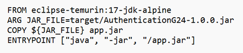
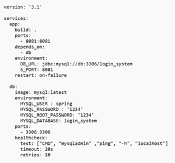
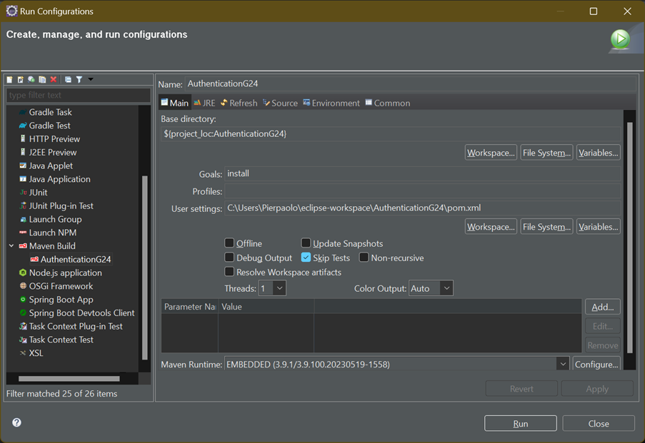

# T23-G24
Requisiti sulla Registrazione ed Autenticazione dei Giocatori

<b>API</b> documentate <a href="https://app.swaggerhub.com/apis-docs/PPORCELLINI/ApplicationG24Api/1.0.0">qui</a>.

<h2> Requisiti </h2>
<b>T2</b>: L’applicazione deve consentire agli studenti di registrarsi per poter conservare la storia delle attività svolte, oppure per accedere a requisiti di gioco più complessi. All’atto della registrazione, lo studente fornirà nome, cognome, un indirizzo e-mail valido ed una password, il sistema dopo aver controllato la validità dei dati forniti, aggiungerà il giocatore all’elenco dei giocatori registrati e gli assocerà un Id univoco. Sarebbe desiderabile raccogliere anche altre informazioni sugli studenti, come il corso di studi a cui sono iscritti (Bachelor, Master Degree, o altro).  
<b>T3</b>: All’atto della autenticazione, lo studente fornirà l’indirizzo e-mail fornito per la registrazione e la relativa password, il sistema dopo aver controllato la validità dei dati forniti, autenticherà il giocatore e gli fornirà una schermata per l’accesso alle funzionalità di gioco o di consultazione delle sessioni di gioco passate.

<h3> Storie utente </h3>
<ol> 
  <li> <b>Come</b> utente non registrato, <b>voglio</b> accedere alla pagina di registrazione dell’applicazione, <b>in modo da</b> potermi registrare.</li>
  <li> <b>Come</b> utente registrato, <b>voglio</b> accedere alla pagina di autenticazione dell’applicazione, <b>in modo da</b> potermi autenticare.</li>
  <li> <b>Come</b> utente registrato, <b>voglio</b> accedere alla pagina di password dimenticata dell’applicazione, <b>in modo da</b> poter recuperare l’account.</li>
  <li> <b>Come</b> admin, <b>voglio</b> accedere alla pagina di gestione utenti, <b>in modo da</b> poter visualizzare l’elenco degli utenti registrati. </li>
</ol>

<h2> Tool e tecnologie utilizzate per lo sviluppo </h2>
<ul>
  <li> <b>IDE e Linguaggio Implementativo</b>: Eclipse IDE, Java 17;</li>
  <li> <b>Database</b>: Database relazionale MySQL 8.0.33;</li>
  <li> <b>Build Automation</b>: Maven;</li>
  <li> <b>Supporto allo sviluppo e Servlet:</b> Spring Tools Suite 4, Spring Boot 3.1.0, Tomcat Apache, Lombok 1.18.26;</li>
  <li> <b>Pattern Architetturali</b>: Spring Web MVC;</li>
  <li> <b>Autenticazione</b>: Spring Security 6.1.0;</li>
  <li> <b>Accesso al Database</b>: Spring Data JPA; </li>
  <li> <b>Template Engine</b>: Thymeleaf; </li>
  <li> <b>Template</b>: HTML, CSS; </li>
  <li> <b>Servizio Email</b>: Spring Java Mail Sender; </li>
  <li> <b>Diagramma UML</b>: Visual Paradigm Community Edition; </li>
  <li> <b>Account Email</b>: Google; </li>
  <li> <b>Container</b>: Docker; </li>
  <li> <b> Strumento di Testing</b>: Postman v10.15. </li>
</ul>

<h2>Installazione</h2>
Per quanto riguarda l’installazione in locale del software, l’applicazione viene fornita attraverso un file JAR denominato AuthenticationG24-1.0.0.jar.  
Per quanto riguarda la <em><b>compatibilità</b></em>, il software richiede un sistema sul quale è installata la versione di Java 17 (o superiore) e un database relazionale MySQL.  
E’ necessario scaricare la libreria <em>lombok</em> per la creazione automatica dei getter/setter e dei costruttori (con e senza argomenti).  
In particolare, attraverso il file di configurazione denominato <em>application.properties</em> (situato nella stessa cartella in cui si trova il file .jar) è possibile configurare opportunamente diversi parametri tra cui: il mail server, l’URL del database e la connessione a quest’ultimo.   Inoltre, è possibile modificare i porti di accesso e uscita dell’applicazione.
 
 

  

 
Per importare il Progetto Maven nell’IDE Eclipse:  

  
File -> Import -> Existing Project into Workspace -> root directory. 
 

Cliccando su finish, il Progetto verrà importato nel workspace.  
A questo punto cliccando con il tasto destro sul pom.xml:  

  
 run as -> maven install

  

Con il comando <em>Maven install</em> viene automaticamente generata la cartella <b></em>target</em></b> che contiene il file .jar usato per l’esecuzione.  
Prima di far partire l’esecuzione in locale dell’applicazione è necessario avviare il database, utilizzando XAMPP.  
Per l’esecuzione in locale viene avviata la Boot Dashboard di Spring (grazie al tool Spring Tool Suite 4):  

  

Dopo aver cliccato sul progetto (“AuthenticationG24”), possiamo avviare l’esecuzione dell’applicazione tramite il pulsante cerchiato in rosso.  
 

  

<h3>Esecuzione con Docker Desktop </h3>
Docker Desktop è un’applicazione che permette di istanziare ed eseguire dei <em>container</em> in un ambiente virtuale.  
Nel nostro caso abbiamo creato due container: il primo contiene l’applicazione, l’altro il database MySQL.  
In particolare abbiamo settato i parametri di configurazione in due file:  
<ul>
  <li><b>Dockerfile:</b>
  

    
  

      <em>FROM</em>: impostare l’ambiente di esecuzione; 
    <em>ARG JAR_FILE</em>: specificare il percorso e il file eseguibile dell’applicazione; 
    <em>COPY JAR_FILE</em>: specificare il file eseguibile per il docker; 
    <em>ENTRYPOINT</em>: comando e parametri del comando per eseguire il programma specificato nel COPY. 
  </li>
   
  <li><b>Docker-compose.yml:</b>
     
   Gestisce la configurazione dei due container e la loro interazione.  
       
  

    
  

     
      Tramite il prompt dei comandi (eseguito in modalità amministratore), ci spostiamo nella directory contenente il progetto e i file docker. 
Digitiamo il comando <em>docker compose up</em> ed automaticamente verranno generati ed eseguiti i container. 
Nel docker compose sono state inserite alcune variabili d’ambiente che servono a configurare la nostra applicazione, ovvero l’URL del database e il porto del server. 
Inoltre non è possibile utilizzare Maven Install per la creazione del .jar  in quanto esso effettua dei test sul database che non è stato ancora generato. 
     
      

    
  

    Si può utilizzare Maven <em>build</em> impostando come goal “install” e selezionando l’opzione <em>Skip test</em>.
  </li>
</ul>

